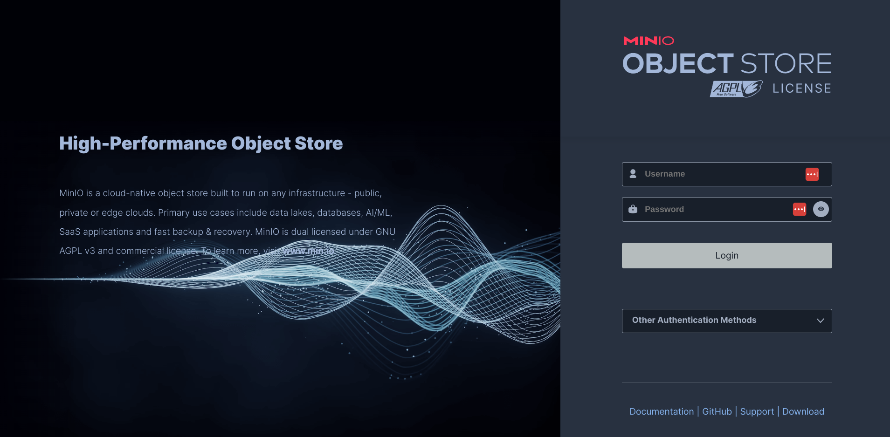
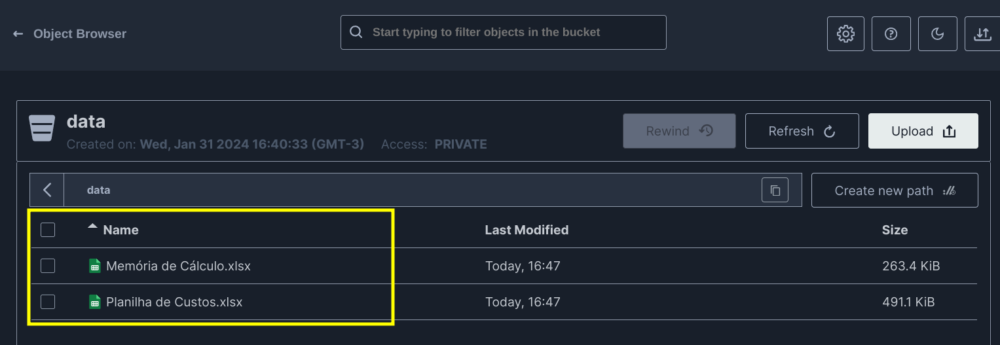

# ByCoders Tecnologia

### Desafio Engenharia de Dados

Por favor leiam este documento do começo ao fim, com muita atenção.
O intuito deste teste é avaliar seus conhecimentos técnicos em programação.
O teste consiste em realizar a ingestão de 2 arquivos excel que se encontram sob o diretório data neste mesmo
repositório, tratar as informações de acordo com as regras para cada aba ( citadas abaixo ), salvar as informações
em algum banco de dados e disponibilizar estes dados em uma API REST.
Este desafio deve ser feito por você em sua casa. O tempo para entrega do desafio é de no máximo 7 dias.

# Instruções de entrega do desafio

1. Primeiro, faça um fork deste projeto para sua conta no Github (crie uma se você não possuir).
2. Em seguida, implemente o projeto tal qual descrito abaixo, em seu clone local.
3. Por fim, envie via email o projeto ou o fork/link do projeto para seu contato Bycoders_ com cópia para
   jessica.lansky@bycoders.com.br .

# Descrição do projeto

Você é o Engenheiro de Dados responsável por fazer a ingestão de dados relacionados a Orçamento Executivo de uma
determinada instituição. Para esta demanda o cliente forneceu 2 tipos de arquivos com os formatos mais utilizados pela
instituição em seu
cotidiano. Os arquivos são específicamente do tipo xlsx. Estes arquivos estarão disponíveis para consumo através de um
sistema de
Blob Storage. Precisamos criar uma maneira para que estes dados sejam importados, transformados e armazenados para que
estejam
disponíveis para consumo.

Sua tarefa é criar uma aplicação que consiga:

- Ler os arquivos do Blob Storage
- Realizar a sanitização dos arquivos deixando apenas os dados relevantes ( segundo tabela abaixo )
- Persistir os dados formatados em disco ( pode ser banco de dados ou blob storage )
- Disponibilizar os dados através de uma das formas:
    - Salvar os arquvios formatados em um bucket no MinIO ( Já está no docker-compose deste projeto )
    - Salvar os resultados em um banco de dados e disponibilizar
      este arquivos através de uma API REST / GraphQL ( Extra )

**Sua aplicação DEVE:**

1. Utilizar Docker para subir todos os serviços necessários.
2. Gravar os logs de todo o fluxo de processamento para futuros debugs
3. Ter endpoints específicos para cada tipo de dados ( segundo tabela abaixo )
4. Ser escrita em Python
5. Consumo dos arquivos precisa ser em Batches Agendados de 10min / 10min.
    - Os mesmos 2 arquivos serão importados em batches de 10 minutos.
    - Caso esteja usando banco de dados, crie uma chave sequencial para não sobrepor os dados na tabela.
    - Caso esteja usando o blob storage, utilize um path que não sobrescreva os arquivos anteriores.
6. Ser simples de configurar e rodar, funcionando em ambiente compatível com Unix (Linux ou Mac OS X).
   Ela deve utilizar apenas linguagens e bibliotecas livres ou gratuitas.
7. Git com commits atômicos e bem descritos
8. Dar preferência aos bancos de dados PostgreSQL, MySQL ou SQL Server se necessário.
10. Readme file descrevendo bem o projeto e seu setup
11. Incluir informação descrevendo como consumir o endpoint da API
12. Documentação da api.(Será um diferencial e pontos extras se fizer)

**Sua aplicação não precisa:**

1. Lidar com autenticação ou autorização ( pontos extras se ela o fizer ).
2. Ser escrita usando algum framework específico (mas não há nada errado em usá-los também, use o que achar melhor).
3. Usar sistemas de monitoramento como Grafana, ELK/Kibana e etc. Precisamos apenas ter uma interface para leitura dos
   logs.
4. Usar Kubernetes. Um Docker-Compose já é o suficiente.
5. Usar quaisquer componentes de nuvem que sejam pagos ou que necessitem de algum tipo de assinatura para ser executado.
6. Ter um arquivo MakeFile para facilitar a execução do projeto, porém será muito bom se tiver.

# Subir o Blob Storage com os arquivos XLSX

#### Execute o seguinte comando:

```shell
docker-compose up -d
```

#### Credenciais de acesso

```
URL: http://0.0.0.0:9001/login
USUARIO: minio
SENHA: minio@2020
```

#### Access Key e Secret key ( default )

```
ACCESS_KEY: blob-storage-acces-key
SECRET_KEY: blob-storage-secret-key
```

#### Observação:

Se nehuma key tiver sido criada, crie uma nova key pela URL: http://0.0.0.0:9001/access-keys
e atualize as referências do seu projeto

#### MinIO ( Tela de Login )



#### Planilhas a serem processadas

As planilhas `Memória de Cálculo.xlsx` e `Planilha de Custos.xlsx` estão dentro do bucket data, conforme
imagem abaixo:


# Conteúdo das Planilhas

| Nome da Planilha   | ABA                       | Descrição                                             | 
|--------------------|---------------------------|-------------------------------------------------------|
| Memória de Cálculo | PQ-3100KP-G-50021         | Listagem de Itens, quantidades e valores              |
| Memória de Cálculo | LD1                       | Listagem de Itens, quantidades e valores              |
| Memória de Cálculo | Orçamento de Investimento | Listagem de Itens, quantidades e valores              |
| Custos             | HISTOGRAMA ELETRICA       | Calendário de utilização de mão de obra direta        |
| Custos             | HISTOGRAMA MECANICA       | Calendário de utilização de mão de obra direta        |
| Custos             | HISTOGRAMA MOI            | Calendário de utilização de mão de obra indireta      |
| Custos             | SALARIOS                  | Valores de Salários por Cargo                         |
| Custos             | EQUIPAMENTOS ELÉTRICA     | Discriminação da utilização de equipamentos elétricos |
| Custos             | Transporte                | Discriminação da utilização de transportes            |
| Custos             | EQUIPAMENTOS MECANICO     | Discriminação da utilização de equipamentos mecânicos |

### Extração dos dados das Planilhas

#### Memória de Cálculo:

##### Exportar as colunas e fazer a coerção de tipos:

- Item -> Varchar
- Descrição dos Serviços -> Varchar
- Unidade -> Varchar
- Quantidade -> Float
- Fornecimento -> Float
- Serviços -> Float
- Composição -> Float
- Preços Totais -> Float

##### Formato de Saída ( Exemplo Json )

```json
{
  "memory_calculation": [
    {
      "item": "<Item>",
      "service_description": "<Descrição dos Serviços>",
      "unity": "<Unidade>",
      "quantity": "<Quantidade>",
      "suply_value": "<Fornecimento>",
      "service_value": "<Serviços>",
      "composition_value": "<Composição>",
      "total_value": "<Preços Totais>"
    }
  ]
}
```

###### Extra

Exportar os dados de cabeçalho da planilha como:

- Nome da Planilha -> Varchar
- Titulo -> Varchar
- Identificador -> Varchar
- Data de Revisão -> Date
- Número da Revisão -> Integer

Estes campos podem ter nomes diferentes através das abas

###### Observações

- Não devem ser exportados itens que sejam marcadores de categoria ou seja
  itens que não tenham unidade, quantidade, e os valores definidos
- Se a coluna de uma aba não aparecer em outra aba, considere criar a coluna faltante
  e atribuir um valor padrão neutro para ela.
- Nunca devem ser importadas colunas marcadas em vermelho

#### Custos

##### Histograma Elétrica:

- Coluna com id do item ( formato 1.1, 1.2, 1.3 ) -> Varchar
- Coluna com resumo do cargo -> Varchar
- Todas as colunas numéricas do histograma e seus valores -> Float

O label da coluna do mês de referência deve ser inteiro e o seu valor deve ser um float.

##### Formato de Saída ( Exemplo Json )

```json
{
  "eletrical_histogram": [
    {
      "item": "<Item>",
      "discrimination": "<Resumo>",
      "months": [
        {
          "reference": "<número de referência do mês>",
          "value": "<valor utilizado no mês>"
        }
      ]
    }
  ]
}
```

##### Histograma Mecânica

- Coluna com id do item ( formato 1.1, 1.2, 1.3 ) -> Varchar
- Coluna com resumo do cargo -> Varchar
- Todas as colunas numéricas do histograma e seus valores -> Float

##### Formato de Saída ( Exemplo Json )

```json
{
  "mechanical_histogram": [
    {
      "item": "<Item>",
      "discrimination": "<Resumo>",
      "months": [
        {
          "reference": "<número de referência do mês>",
          "value": "<valor utilizado no mês>"
        }
      ]
    }
  ]
}
```

##### Histograma MOI

- Coluna com id do item ( formato 4.23, 4.24, 4.25 ) -> Varchar
- Coluna com resumo do cargo -> Varchar
- Todas as colunas numéricas do histograma e seus valores -> Float

Somente exportar as colunas do histograma que contenham valores de item

##### Formato de Saída ( Exemplo Json )

```json
{
  "moi_histogram": [
    {
      "item": "<Item>",
      "discrimination": "<Resumo>",
      "months": [
        {
          "reference": "<número de referência do mês>",
          "value": "<valor utilizado no mês>"
        }
      ]
    }
  ]
}
```

#### Salários:

- Centro de Custo -> Varchar
- Item -> Varchar
- Discriminação -> Varchar
- Salário Mensal -> Float
- Total -> Float

##### Formato de Saída ( Exemplo Json )

```json
{
  "financial_plan": "<Centro de Custo>",
  "salaries": [
    {
      "item": "<Item>",
      "discrimination": "<Discriminação>",
      "monthly_salary": "<Salário Mensal>",
      "total": "<Total>"
    }
  ]
}
```

#### Equipamentos Elétrica:

- Centro de Custo -> Varchar
- Discriminação -> Varchar
- Valor Unitário -> Float
- Total -> Float

##### Formato de Saída ( Exemplo Json )

```json
{
  "financial_plan": "<Centro de Custo>",
  "eletrical_equipments": [
    {
      "discrimination": "<Discriminação>",
      "months_value": "<Valor Unitário>",
      "total": "<Total>"
    }
  ]
}
```

#### Transporte:

- Centro de Custo -> Varchar
- Discriminação -> Varchar
- Valor -> Float
- Total -> Float

##### Formato de Saída ( Exemplo Json )

```json
{
  "financial_plan": "<Centro de Custo>",
  "transport": [
    {
      "discrimination": "<Discriminação>",
      "months_value": "<Valor>",
      "total": "<Total>"
    }
  ]
}
```

#### Equipamentos Mecânico:

- Centro de Custo -> Varchar
- Equipamentos Principais -> Varchar
- Locação Mês -> Float
- Total -> Float

##### Formato de Saída ( Exemplo Json )

```json
{
  "financial_plan": "<número do plano financeiro>",
  "mechanical_equipments": [
    {
      "description": "<Equipamentos Principais>",
      "months_rental": "<Locação Mês>",
      "total": "<Total>"
    }
  ]
}
```

**Somente exportar as colunas que possuem o valores de centro de custo ( coluna marcada com em Verde Claro )**

### Relacionamentos entre os dados das Planilhas

Após a extração dos dados precisamos que algumas informações sejam cruzadas. Você pode
fazer o cruzamento das informaçõe no momento em que desejar.

#### Histograma x Salários:

Os dados do Histograma Elétrica, Mecânica e MOI devem ser cruzados com os dados de Salários
para que seja possível determinar a quantidade de horas cada que cada cargo utilizou ao longo do
projeto e o seu custo. Não é necessário realizar os calcúlos, apenas cruzar
os dados e disponibilizá-los no seguinte formato:

##### Formato de Saída ( Exemplo Json )

```json
{
  "salary": [
    {
      "name": "<nome da aba  -> Varchar>",
      "job_type": "<descrição do tipo de trabalho se é direto ou indireto -> Varchar>",
      "financial_plan": "<número do centro de custo -> Varchar>",
      "external_id": "<número do item -> Varchar>",
      "salary": "<valor do salário -> Float>",
      "work_schedules": [
        {
          "period": "<número de referência do mês no histograma -> Integer>",
          "quantity": "<valor utilizado no mês -> Float>"
        }
      ]
    }
  ]
}
```

#### Somatório de Centro de Custos

Precisamos que seja realizado o somatório do valor total de cada centro de custo nas planilhas:

- Equipamentos Elétrica
- Transporte
- Equipamentos Mecânico
  Os dados deste cruzamento devem ser disponibilizados no seguinte formato:

##### Formato de Saída ( Exemplo Json )

```json
{
  "project_cost_sheets": [
    {
      "financial_plan_external_id": "<número do centro de custo -> Varchar>",
      "total": "<somatorio sobre as planilhas -> Float>"
    }
  ]
}
```

## Disponibilização dos Dados

### Via API ( API Rest / Json RPC / GraphQL )

A disponibilização dos dados será realizada a partir de uma API. Pode ser utilizado
qualquer tipo de API sendo REST, Json RPC ou GraphQL. Os dados devem estar disponíveis
através da API em endpoints diferentes tendo um campo de data como filtro.

Ex:

| Recurso            | ABA                        | Endpoint                                                                      | 
|--------------------|----------------------------|-------------------------------------------------------------------------------|
| Memória de Cálculo | PQ-3100KP-G-50021          | /memoria-calculo/pq-1?start=2024-01-01T00:00:00&end=2024-01-01T23:59:59       |
| Memória de Cálculo | LD1                        | /memoria-calculo/pq-2?start=2024-01-01T00:00:00&end=2024-01-01T23:59:59       |
| Memória de Cálculo | Orçamento de Investimento  | /memoria-calculo/pq-3?start=2024-01-01T00:00:00&end=2024-01-01T23:59:59       |
| Custos             | HISTOGRAMA ELETRICA        | /custo/histograma/eletrica?start=2024-01-01T00:00:00&end=2024-01-01T23:59:59  |
| Custos             | HISTOGRAMA MECANICA        | /custo/histograma/mecanica?start=2024-01-01T00:00:00&end=2024-01-01T23:59:59  |
| Custos             | HISTOGRAMA MOI             | /custo/histograma/moi?start=2024-01-01T00:00:00&end=2024-01-01T23:59:59       |
| Custos             | SALARIOS                   | /custo/salario?start=2024-01-01T00:00:00&end=2024-01-01T23:59:59              |
| Custos             | EQUIPAMENTOS ELÉTRICA      | /custo/equipamento/eletrica?start=2024-01-01T00:00:00&end=2024-01-01T23:59:59 |
| Custos             | EQUIPAMENTOS MECANICO      | /custo/equipamento/mecanico?start=2024-01-01T00:00:00&end=2024-01-01T23:59:59 |
| Custos             | Transporte                 | /custo/transporte?start=2024-01-01T00:00:00&end=2024-01-01T23:59:59           |
| Custos             | Histograma x Salarios      | /custo/histograma-salarios?start=2024-01-01T00:00:00&end=2024-01-01T23:59:59  |
| Custos             | Somatório Centro de Custos | /custo/somatorio?start=2024-01-01T00:00:00&end=2024-01-01T23:59:59            |

Não é necessário ter um alto período de retenção, apenas uma faixa específica para que consigamos
consultar os dados através da API

### Opção de disponibilização dos dados via Blob Storage

Na segunda opção, você terá a possibilidade de disponibilizar os dados em um bucket do MinIO.
Os dados devem estar em formato json ( para facilitar a visualização ). Podem estar em qualquer
tipo de hierarquia de pastas desde que estejam apartados dos arquivos utilizados no processamento.
Para enviar os dados para o Blob Storage utilize a lib Boto3 passando o parâmetro host e port,
juntamente com a API KEY e SECRET KEY gerado dentro do MinIO.

# Avaliação

Seu projeto será avaliado de acordo com os seguintes critérios.

1. Sua aplicação preenche os requerimentos básicos?
2. Você documentou a maneira de configurar o ambiente e rodar sua aplicação?
3. Você seguiu as instruções de envio do desafio?
4. Qualidade do código.
5. Documentação.

Adicionalmente, tentaremos verificar a sua familiarização com as bibliotecas padrões (standard libs), bem como sua
experiência com programação orientada a objetos a partir da estrutura de seu projeto.

---

Boa sorte!
